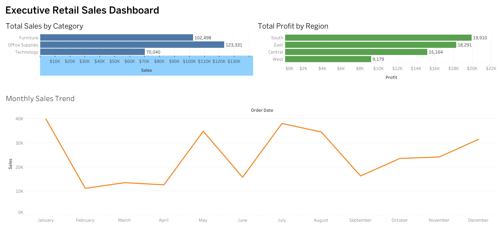

# Executive Retail Sales Dashboard

## Overview

This project presents an interactive Tableau dashboard that analyzes retail sales performance using a sample retail dataset. The dashboard provides insights into sales by product category, profit by region, and monthly sales trends, helping users identify key business patterns and support data-driven decision-making.

## Dashboard Preview

## Live Dashboard

View the interactive dashboard on Tableau Public:

**Tableau Public:** https://public.tableau.com/views/Executive_Retail_Sales_Dashboard/Dashboard1?:language=en-US&:sid=&:redirect=auth&:display_count=n&:origin=viz_share_link

## Key Features

- Total Sales by Category
- Total Profit by Region
- Monthly Sales Trend Analysis
- Interactive Tableau Dashboard
- Professional dashboard layout and formatting

## Tools Used

- Tableau Public
- Microsoft Excel

## Dataset

The dataset contains retail sales transactions, including:

- Order ID
- Order Date
- Region
- Category
- Product
- Quantity
- Unit Price
- Sales
- Profit

## Dashboard Insights

### Sales by Category
Compares total sales across different product categories to identify the strongest-performing business segments.

### Profit by Region
Displays total profit generated in each region, highlighting the most profitable markets.

### Monthly Sales Trend
Visualizes monthly sales performance to identify seasonal patterns and overall business trends.

## Skills Demonstrated

- Data Visualization
- Business Intelligence
- Dashboard Design
- Data Cleaning
- KPI Reporting
- Trend Analysis
- Tableau Public
- Excel Analytics
